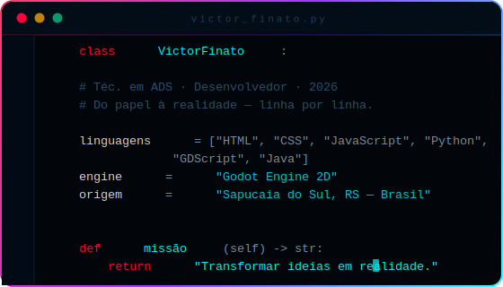

<div align="center">


</div>

<div align="center">

[](https://git.io/typing-svg)

</div>

<br/>

<div align="center">

&ensp;&ensp;

</div>

---


### `// 01.` QUEM EU SOU



<br clear="right"/>

---

### `// 02.` STACK

<div align="center">

<table>
<tr>
<td align="center" width="90"><br/><sub><b>HTML5</b></sub></td>
<td align="center" width="90"><br/><sub><b>CSS3</b></sub></td>
<td align="center" width="90"><br/><sub><b>JavaScript</b></sub></td>
<td align="center" width="90"><br/><sub><b>Python</b></sub></td>
<td align="center" width="90"><br/><sub><b>GDScript</b></sub></td>
<td align="center" width="90"><br/><sub><b>Java</b></sub></td>
<td align="center" width="90"><br/><sub><b>Git</b></sub></td>
<td align="center" width="90"><br/><sub><b>GitHub</b></sub></td>
</tr>
</table>

**Em estudo:**&nbsp;
`Mobile` &nbsp;·&nbsp; `Back-End` &nbsp;·&nbsp; `I.A.` &nbsp;·&nbsp; `Jogos 3D` &nbsp;·&nbsp; `Banco de Dados`

</div>

---

### `// 03.` PROJETOS

<table>
<tr>
<td width="50%" valign="top">


#### PlatGAME *(Remake)*
> Plataforma 2D repensada do zero — mais fluida, mais viva, mais ambiciosa.

```
▸ Arte em PixelArt colorido e detalhado
▸ Sistema de skins para customização
▸ Progressão de dificuldade por fases
▸ Iteração contínua com base em feedback
```


</td>
<td width="50%" valign="top">


#### Save The Pirate!
> Ação e sobrevivência em um jogo completo, construído do zero e publicado.

```
▸ Combate com espada e mecânicas de esquiva
▸ Loja com upgrades e boosters estratégicos
▸ Boss Fights desafiadores e progressivos
▸ Sistema de fases com dificuldade crescente
```


</td>
</tr>
<tr>
<td width="50%" valign="top">


#### Moon Mist
> RPG TopDown 2D com narrativa envolvente e combate refinado.

```
▸ Sistema de quests com narrativa ramificada
▸ Evolução de personagem por decisões
▸ Combate fluido guiado por GDD sólido
▸ Atmosfera visual única e imersiva
```


</td>
<td width="50%" valign="top">


#### FinatoBase
> Plataforma pessoal de estudos e produtividade com I.A. integrada.

```
▸ Organização de aulas, projetos e ideias
▸ Central unificada de informações pessoais
▸ Agenda inteligente com alertas e prioridades
▸ I.A. para resumos, revisões e insights
```


</td>
</tr>
</table>

---

### `// 04.` EXPERIÊNCIAS

```
[✓]  Sites e Páginas Web        —  Projetos funcionais para uso real e demonstração
[✓]  Sistemas e Mini Projetos   —  Lógica aplicada na resolução de problemas concretos
[✓]  Jogos Completos            —  Sistemas complexos arquitetados e entregues do zero
[✓]  App Didático               —  Solução própria adotada no dia a dia, com impacto real
[✓]  Game Jam — 7 Dias          —  Concepção, desenvolvimento e entrega sob pressão de prazo
```

---

### `// 05.` ESTATÍSTICAS

<div align="center">


</div>

---

### `// 06.` ROADMAP

```
[✓]  Criar Sistemas Próprios
[✓]  Desenvolver Apps e Automações
[✓]  Construir Sites e Interfaces
[ ]  Finalizar e Publicar Projetos em Andamento
[ ]  Expandir e Solidificar Conhecimentos
[ ]  Entrar na criação de Bots e Agentes com I.A.
```

---

<div align="center">

[](https://finatodev.itch.io)&ensp;[](https://github.com/victorfinatosoares)

<br/>

*"Todo o começo é considerado* ***pequeno*** *— até que se torne grandioso."*

<br/>


</div>