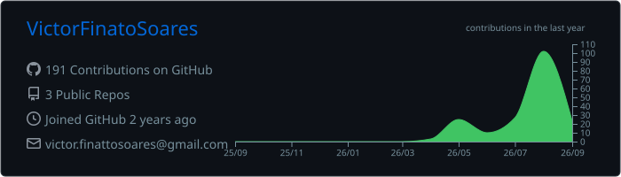
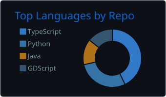
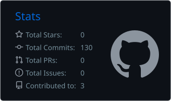

# Victor Finato Soares

🚀 Full-Stack Developer in training
🇧🇷 Brazil

I'm a student and developer focused on building a strong foundation in software development and turning ideas into real projects.

I'm currently studying **Systems Development** at **IFSul — Campus Sapucaia do Sul**, in an integrated technical program alongside high school.

My main focus is **Full-Stack Development**, exploring both frontend and backend technologies while continuously improving my knowledge of software architecture, APIs, databases and modern development practices.

I enjoy understanding how things work — not just making them work.

---

## 🌐 Where to find me

---

## 🎓 Education

### Instituto Federal Sul-rio-grandense — IFSul

**Campus Sapucaia do Sul**

🎓 **Integrated Technical Program in Systems Development**

My education combines high school studies with technical subjects related to programming, software development and computing.

Through the course and my own studies, I'm developing knowledge in areas such as:

* Programming logic
* Web development
* Object-oriented programming
* Software development
* Databases
* Software engineering concepts
* Problem solving

---

## 🧠 What I'm focused on

* 💻 Full-Stack Development
* 🌐 Building modern web applications
* ⚙️ Backend development and APIs
* 🧩 Software architecture and clean code
* 📱 Exploring mobile development
* 📚 Constantly learning new technologies

---

## 🛠️ Tech Stack

### Frontend

### Backend & Programming

### Tools

---

## 📚 Currently Learning

I'm currently improving my knowledge of:

* Java
* TypeScript
* React
* Backend development
* Software architecture
* Full-Stack application development

---

## 🚀 Projects

I use my projects as a way to transform what I study into practical experience.

My goal isn't just to follow tutorials — it's to understand the technologies I use and gradually build more complete, useful and well-structured applications.

### 🔎 Finato GitHub Search

One of my projects is **Finato GitHub Search**, a web application I built while learning **React**.

It allows users to search for a GitHub username and retrieve information about that profile using the GitHub API.

Through this project, I practiced concepts such as:

* React components
* State management
* API consumption
* Asynchronous JavaScript
* User input and search
* Conditional rendering
* Component organization
* Deploying a web application

🌐 **Live Project:**
[finato-github-search.netlify.app](https://finato-github-search.netlify.app)

---

Check out my other repositories to see what I'm currently building:

👉 **[github.com/VictorFinatoSoares](https://github.com/VictorFinatoSoares)**

---
## 📊 GitHub Stats

 

---

## 🎯 Goals

My current goal is to become a solid **Full-Stack Developer**, gaining experience building real applications and understanding the entire development process.

In the long term, I want to use that experience to build products and solutions of my own.

---

## 💭 Philosophy

> "Learning how to code is not just about learning syntax.
> It's about learning how to think, solve problems and turn ideas into reality."

---

⭐ Feel free to explore my repositories and follow my development journey.
